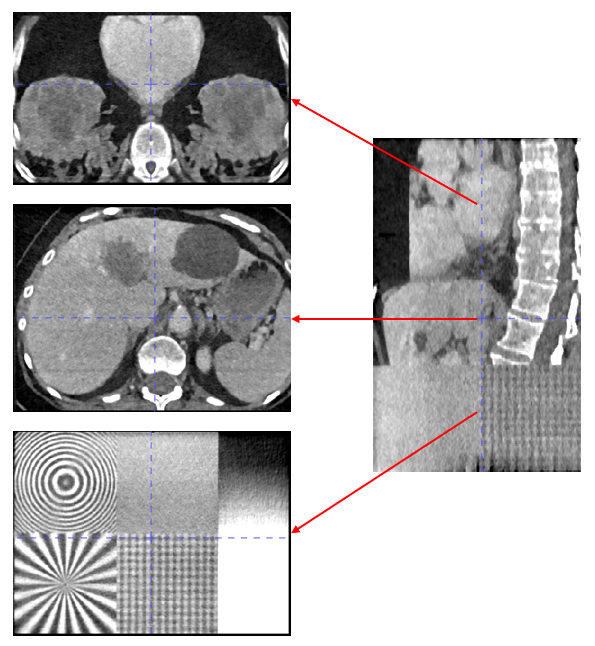
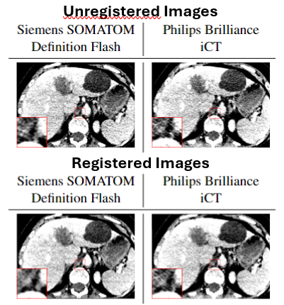
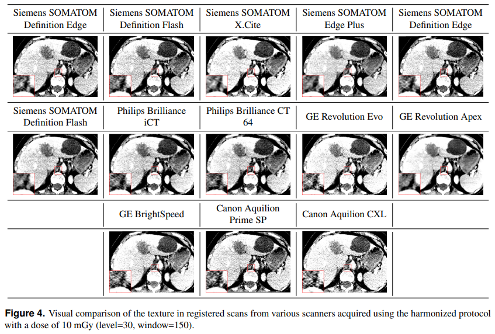
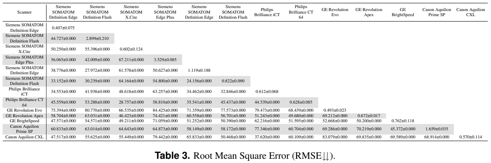
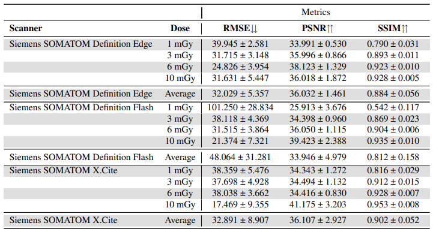

## A Multi-Centric Anthropomorphic 3D CT Phantom-Based Benchmark Dataset for Harmonization
This repository contains all the tools to reproduce the Figures and Tables published in conjunction with this paper:

The dataset associated with these analyses is publicly available here:

The dataset is collected by acquiring multiple scans of an anthropomorphic phantom, which includes three different regions: thoracic, liver, and test patterns:

    

# Organization of the Repository:
There are three files (utils.py, ImageRegistration.py, and registered_dataset.py) which contain the required classes and functions for preprocessing the raw DICOM dataset into NIfTI format. The remaining files correspond to the code for computing results and different measures presented in various Tables and Figures of the paper.

# Preprocessing the Dataset:
Before computing various metrics in the image and feature domains or based on predictions for diagnosis, we preprocess the data with the goal of removing discrepancies related to the position of the phantom in the scan. This ensures that we only account for differences caused by the scanner used for image acquisition, mainly reflected in the texture of the images.

The preprocessing also converts the original DICOM stack into NIfTI format, which is more straightforward to load for training deep learning models. These functions and classes are presented in the following scripts:

- registered_dataset.py: This script converts the original DICOM dataset into a registered NIfTI dataset, crops the volumes to the region containing the phantom, and removes the air around the phantom.
- ImageRegistration.py: This class is developed for image registration and contains two libraries to perform the registration.
- utils.py: This file includes functions commonly used in the other scripts, such as reading the data, flipping the volume along one axis, different data format conversions, and plotting.

# Reproducing the Paper's Results:
All the scripts developed for computing the metrics use the registered dataset in NIfTI format for simplicity and to enhance the efficiency of loading the data. Therefore, prior to any other step, the original dataset should be converted to NIfTI format using the registered_dataset.py script as described above.

Then, the results presented in the paper can be computed using the following scripts:

- scanner_comparison.py: This script depicts a slice of the phantom from the liver region and compares the texture properties of the scans acquired from different scanners. It is possible to zoom into a specific region and magnify it by an arbitrary factor for a closer look at the texture changes (Figure 4).

<>

- compute_metrics_scanner.py: This code computes several metrics, including root mean square error (RMSE), peak signal-to-noise ratio (PSNR), and structural similarity (SSIM) between different scanners, averaging them over several repetitions of scans acquired using the harmonized protocol (Tables 3-5).

<>

- compute_metrics_dose.py: This code computes several metrics, including RMSE, PSNR, and SSIM, between different doses for each scanner, averaging them over several repetitions of scans (Table 6).

<>
